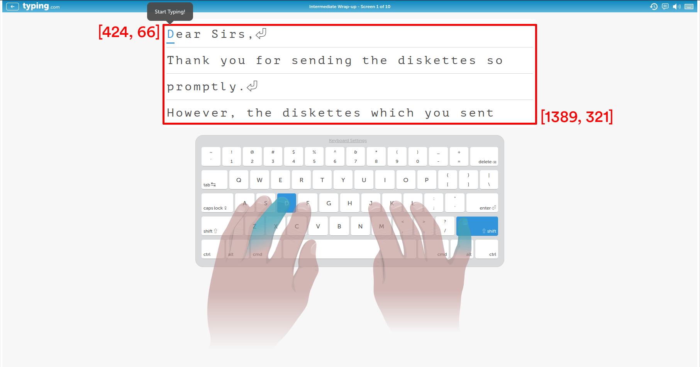

### Typewriter
A typing bot that autonomously completes most typing challenges from typing websites such as [Typing.com](https://typing.com) using computer vision.

#
#### 1. Configuration in `config.json`
```JSON
{
    "TargetWPM": 100,
    "TargetAccuracy": 95,
    "MistakeReactionTime": 0.3,

    "BBTopLeftX": 473,
    "BBTopLeftY": 139,
    "BBBottomRightX": 1428,
    "BBBottomRightY": 427,

    "DelayBeforeTyping": 1
}
```
 - **`TargetWPM`**: The bot's target typing speed in words-per-minute (note that some randomness is applied alongside this general target speed)
 - **`TargetAccuracy`**: The target percentage of letters to type correctly (a **`TargetAccuracy`** of 90 will result in *around* 90% accuracy in the challenge)
 - **`MistakeReactionTime`**: The amount of time (in seconds) before the bot will "realize" it made a mistake and press the Backspace key to correct the letter.
   - Does not apply if **`TargetAccuracy`** is set to `100`
 - **`BBTopLeftX`, `BBTopLeftY`, `BBBottomRightX`, and `BBBottomRightY`**: Screen coordinates for the box that shows what letters need to be typed. I recommend screenshotting an in-progress lesson and using image software to get these screen coordinates.
  
 - **`DelayBeforeTyping`**: A delay amount (in seconds) to wait after the program starts before the screen is scanned for typing. This gives you some time to switch to the website window after starting the program.
   - Very important for single-monitor setups or situations where the window may be obstructed.

#### 2. Screen Setup
 1. Find the screen coordinates for the edge of the area that shows what characters need to be typed.
    - While in use, this area will be screenshotted to memory and processed using [Tesseract](https://github.com/tesseract-ocr/tesseract)'s Optical Character Recognition (OCR) algorithm to find individual letters. 

#### 3. Dependencies
 1. Install `python3-tk` and `python3-dev`
      
        sudo apt-get install python3-tk python3-dev
  
 2. Install Python Packages (`opencv`, `pyautogui`, `pytesseract`, `pyscreenshot`)
  
        python3 -m pip install opencv-python pyautogui pytesseract pyscreenshot

#### 3. Tesseract OCR Binaries/Models
 1.  Download [Tesseract](https://github.com/tesseract-ocr/tesseract) for your respective operating system.
       - Debian-based: 

              sudo apt install tesseract-ocr

       - Arch-based (AUR):

              git clone https://aur.archlinux.org/packages/tesseract-git
              cd tesseract-git/
              makepkg -si

       - Windows
         - https://tesseract-ocr.github.io/tessdoc/Downloads.html

 2. Make sure that Tesseract is installed and available from the terminal by running the command "`tesseract`"
  
        ~$ tesseract

        Usage:
          tesseract --help | --help-extra | --version
          tesseract --list-langs
          tesseract imagename outputbase [options...] [configfile...]

        OCR options:
          -l LANG[+LANG]    Specify language(s) used for OCR.
        NOTE: These options must occur before any configfile.

        Single options:
          --help            Show this help message.
          --help-extra      Show extra help for advanced users.
          --version         Show version information.
          --list-langs      List available languages for tesseract engine.

###

 - Clone the [tesseract-ocr/tessdata](https://github.com/tesseract-ocr/tessdata) repository to the `Typewriter` folder.

        Typewriter
        │   .gitignore
        │   config.json
        │   LICENSE
        │   README.md
        │   Typewriter.py
        │
        └───tessdata          <-- HERE
        │   │   .gitmodules
        │   │   LICENSE
        │   │   ...more...
        │   
        └───images
            │   Screenshot.png

 - Try setting the `TESSDATA_PREFIX` environment variable to the path of the `tessdata` folder if the program sends an error.
   - Linux: `export TESSDATA_PREFIX=AbsolutePathToYourTessdataFolder`

#### 4. Running
 - Currently, you have to start the Python script and then switch the focused window (Alt-Tab) to the website for the bot to type.
   - Make sure that the entire letter area is unobstructed and clearly visible.
 - This process will be made easier in future updates.

#### 5. Known issues

<div>The script does not recognize newline/Return icons, or other indicators on typing websites.</div>

#### More
 - I included a Tampermonkey script in the `/userscripts` folder that helps to de-clutter the [Typing.com](https://typing.com) lesson UI for the program to read easier.
 - Use with care and common sense, as always.